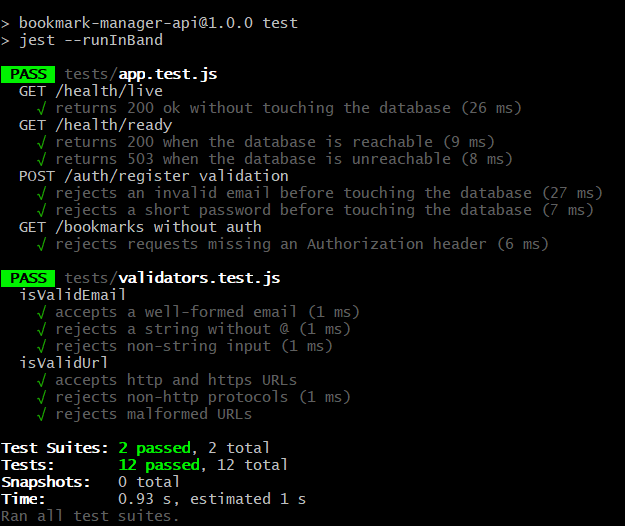
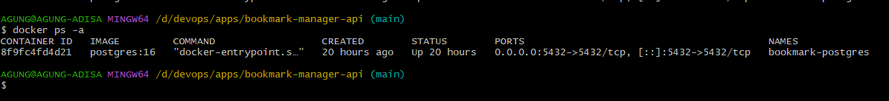
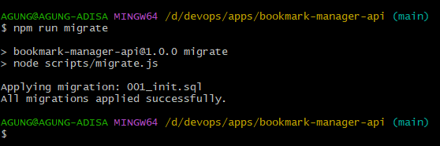
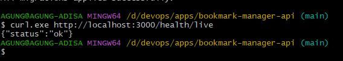
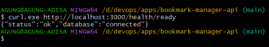
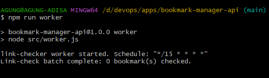
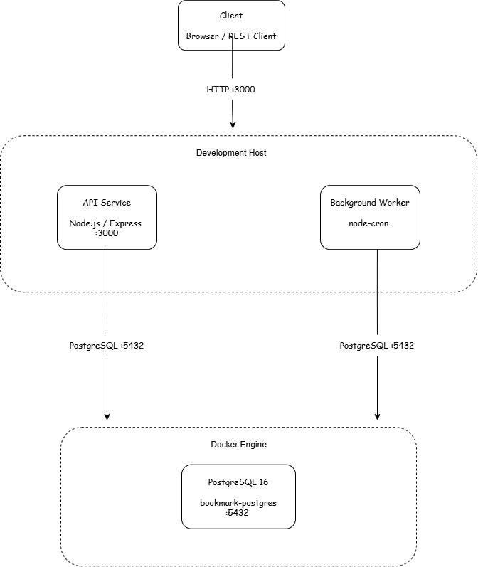

# Baseline Validation

Before containerizing the application, I first validated the developer handoff
in a working environment.

The goal was simple: make sure the application, database, API, and worker are
all working before changing the deployment model.

## Environment

| Component | Value |
|---|---|
| Node.js | 24.x |
| PostgreSQL | 16 |
| Database | `bookmark_manager` |
| API | `localhost:3000` |
| PostgreSQL | `localhost:5432` |

At this stage, the API and worker still run directly on the host. PostgreSQL is
the first component running in Docker.

## Test Result

The existing test suite passed:

```text
Test Suites: 2 passed
Tests:       12 passed
Failures:    0
```



The tests use a mocked database, so I also tested the application against a
real PostgreSQL instance.

## PostgreSQL

PostgreSQL was started as a Docker container:

```text
Container : bookmark-postgres
Image     : postgres:16
Database  : bookmark_manager
Port      : 5432
```

The container reached the ready state and accepted connections.



## Database Migration

The application migration was then run against the PostgreSQL container:

```text
npm run migrate
```

Result:

```text
Applying migration: 001_init.sql
All migrations applied successfully.
```



## API

The API was started with:

```text
npm start
```

### Liveness

```text
GET /health/live
```

Response:

```json
{
  "status": "ok"
}
```



### Readiness

```text
GET /health/ready
```

Response:

```json
{
  "status": "ok",
  "database": "connected"
}
```

This was the important check for the baseline because it shows that the API
can reach the PostgreSQL database.



## Worker

The background worker was started with:

```text
npm run worker
```

Startup output:

```text
link-checker worker started. Schedule: "*/15 * * * *"
Link-check batch complete: 0 bookmark(s) checked.
```

The worker started normally. There were no bookmarks in the database yet, so
there was nothing to process.



## Baseline Architecture

At this stage, the API and worker still run directly on the development host,
while PostgreSQL runs as a Docker container.



## Result

The application is working against a real PostgreSQL instance:

- automated tests pass;
- database migration succeeds;
- API liveness works;
- API readiness reports `database: connected`;
- worker starts successfully.

With the baseline working, the application is ready for the next step:

**containerizing the API and worker.**

## Next Step

Containerize the API and worker as separate containers while keeping
PostgreSQL as a separate service.