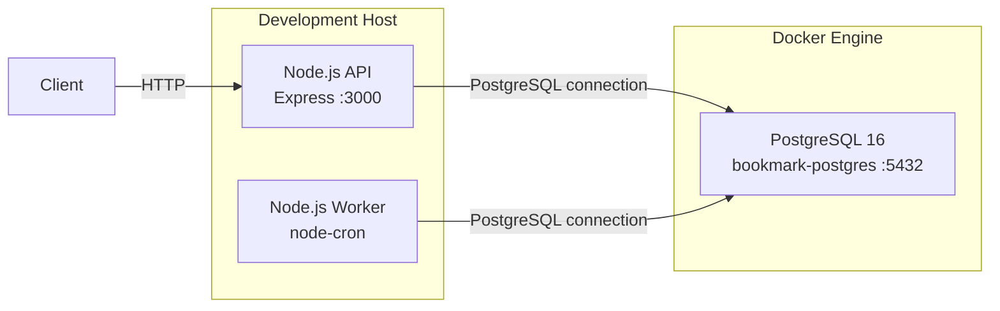

# Baseline Validation

## Purpose

This document records the validation of the developer-provided application
before introducing containerization and additional infrastructure.

The purpose of this phase is to establish a known-good baseline. Every
infrastructure change introduced in later phases will be validated against
this baseline.

## Environment

| Component | Configuration |
|---|---|
| Operating System | Windows |
| Node.js | 24.x |
| PostgreSQL | 16.x |
| Application | Node.js / Express |
| Database | `bookmark_manager` |
| API Port | `3000` |
| PostgreSQL Port | `5432` |
| PostgreSQL Runtime | Docker container |

## Validation Result

| Area | Validation | Result |
|---|---|---|
| Application | `npm install` | PASS |
| Application | `npm test` | PASS — 12/12 tests |
| Database | PostgreSQL container | PASS |
| Database | PostgreSQL readiness | PASS |
| Database | `npm run migrate` | PASS |
| API | Application startup | PASS |
| API | `GET /health/live` | PASS |
| API | `GET /health/ready` | PASS |
| Worker | Worker startup | PASS |

**Baseline status: READY FOR CONTAINERIZATION**

---

## 1. Application Test

The existing automated test suite was executed before introducing
infrastructure changes.

```text
Test Suites: 2 passed
Tests:       12 passed
Failures:    0
```

The application test suite passes successfully.

The tests use a mocked database layer, therefore this result alone does not
prove connectivity to a real PostgreSQL instance. Database connectivity is
validated separately in the next stages.

---

## 2. PostgreSQL Validation

PostgreSQL 16 was deployed as a Docker container with the following
configuration:

| Parameter | Value |
|---|---|
| Container | `bookmark-postgres` |
| Database | `bookmark_manager` |
| User | `bookmark_user` |
| Port | `5432` |
| Host mapping | `localhost:5432` |

The container reached the PostgreSQL ready state successfully.

```text
database system is ready to accept connections
```

This confirms that the database service is operational and accepting
connections.

---

## 3. Database Migration

The application migration process was executed against the PostgreSQL
container.

Command:

```text
npm run migrate
```

Result:

```text
Applying migration: 001_init.sql
All migrations applied successfully.
```

This confirms that the application can initialize its database schema against
a real PostgreSQL instance.

---

## 4. API Validation

The API was started using the developer-provided runtime command:

```text
npm start
```

### Liveness

Request:

```text
GET /health/live
```

Response:

```json
{
  "status": "ok"
}
```

The liveness check confirms that the API process is running.

### Readiness

Request:

```text
GET /health/ready
```

Response:

```json
{
  "status": "ok",
  "database": "connected"
}
```

The readiness check confirms both:

1. The API process is running.
2. The API can successfully connect to PostgreSQL.

This is a critical baseline result because database connectivity will remain
an important dependency when the application is containerized.

---

## 5. Worker Validation

The background worker was started using:

```text
npm run worker
```

Startup output:

```text
link-checker worker started. Schedule: "*/15 * * * *"
Link-check batch complete: 0 bookmark(s) checked.
```

The worker started successfully and remained operational.

The worker reported zero bookmarks because the database contained no bookmark
records during baseline validation. This is expected and is not considered a
failure.

---

## 6. Baseline Runtime Architecture

The validated runtime consists of the Node.js API, the background worker, and
the PostgreSQL container.



This represents the **baseline runtime only**.

The API and worker are still running directly as Node.js processes on the host.
Only PostgreSQL is currently containerized.

---

## 7. Baseline Verification

The complete validation flow is:

```text
Developer Handoff
        │
        ▼
Application Tests
        │
        ▼
PostgreSQL Container
        │
        ▼
Database Migration
        │
        ▼
API Startup
        │
        ├──────► /health/live
        │
        └──────► /health/ready
                    │
                    ▼
             Database Connected
        │
        ▼
Worker Startup
        │
        ▼
Baseline Validated
```

All validation steps completed successfully.

---

## Conclusion

The developer-provided application has been validated successfully against a
real PostgreSQL instance before introducing containerization for the
application processes.

The baseline confirms that:

- The automated application tests pass.
- PostgreSQL is operational.
- Database migrations execute successfully.
- The API starts successfully.
- The liveness endpoint responds successfully.
- The readiness endpoint confirms database connectivity.
- The background worker starts successfully.

The application is therefore considered:

**READY FOR CONTAINERIZATION**

The next phase will containerize the API and worker as separate deployment
units while keeping PostgreSQL as a separate service.