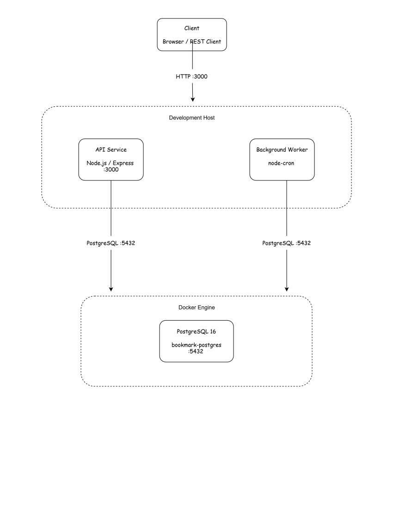

# Baseline Validation

Before containerizing the application, I first validated the [developer handoff](./developer-handoff.md) in a working environment. The goal was simple: confirm the application, database, API, and worker all work correctly before changing the deployment model — so that any issue found later during containerization can be attributed to Docker, not to the application itself.

## Environment

| Component        | Value                |
|---------------------|-------------------------|
| Node.js             | 24.x                    |
| PostgreSQL          | 16                       |
| Database            | `bookmark_manager`       |
| API address          | `localhost:3000`         |
| PostgreSQL address    | `localhost:5432`         |

At this stage, the API and worker still run directly on the local development host. PostgreSQL is the first component running in Docker through Docker Desktop.

## 1. Automated Tests

The existing test suite passed:

```text
Test Suites: 2 passed
Tests:       12 passed
Failures:    0
```


The test suite uses a mocked database, so this alone doesn't prove the application works against a real one — the following steps validate that against an actual PostgreSQL instance.

## 2. PostgreSQL

PostgreSQL was started as a Docker container:

```text
Container : bookmark-postgres
Image     : postgres:16
Database  : bookmark_manager
Port      : 5432
```

The container reached the ready state and accepted connections.


## 3. Database Migration

The migration was run against the PostgreSQL container:

```bash
npm run migrate
```

```text
Applying migration: 001_init.sql
All migrations applied successfully.
```


## 4. API

The API was started with:

```bash
npm start
```

**Liveness — `GET /health/live`**

```json
{ "status": "ok" }
```


**Readiness — `GET /health/ready`**

```json
{ "status": "ok", "database": "connected" }
```

This was the key check for the baseline: it confirms the API can actually reach the PostgreSQL database, not just that the process is running.


## 5. Worker

The background worker was started with:

```bash
npm run worker
```

```text
link-checker worker started. Schedule: "*/15 * * * *"
Link-check batch complete: 0 bookmark(s) checked.
```

The worker started normally. There were no bookmarks in the database yet, so there was nothing to process — this is expected at this stage.


## Baseline Architecture

At this stage, the API and worker still run directly on the development host, while PostgreSQL runs as a Docker container.



## Result

The application works correctly against a real PostgreSQL instance:

- Automated tests pass
- Database migration succeeds
- API liveness responds correctly
- API readiness confirms `database: connected`
- Worker starts and runs its schedule successfully

With this baseline confirmed, the application is ready for the next step.

## Next Step

Containerize the API and worker as separate containers while keeping PostgreSQL as a separate service — see [`docker-validation.md`](./docker-validation.md) for the full result.