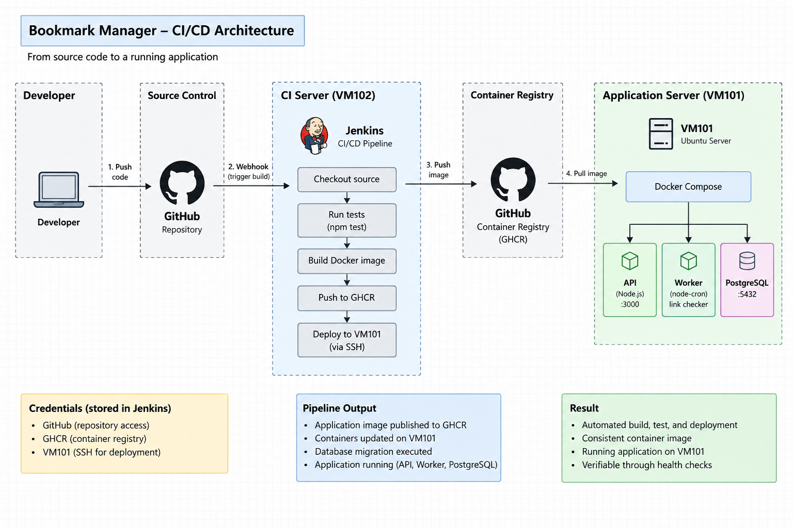

# CI/CD & Application Deployment Validation

## Objective

Automate the delivery of the Bookmark Manager application from source control to the application VM using Jenkins.

The pipeline validates the complete delivery path — source checkout, dependency installation, application testing, Docker image build, image publication to GHCR, remote deployment to VM101, database migration, and post-deployment health validation.

## CI/CD Architecture



## Stack

| Component | Purpose |
|-----------|---------|
| GitHub | Source code repository |
| Jenkins VM102 | CI/CD server and pipeline execution |
| Jenkins | Automates test, build, image publication, and deployment |
| GHCR | Private Docker image registry |
| VM101 | Application deployment target |
| Docker Compose | Production application orchestration |
| PostgreSQL | Application database |

## Deployment Architecture

```text
GitHub
   │
   ▼
Jenkins VM102
   │
   ├── npm ci
   ├── npm test
   └── Docker build
          │
          ▼
        GHCR
          │
          ▼
     VM101 / Docker Compose
          │
          ├── API
          ├── Worker
          └── PostgreSQL
```

The CI/CD server and application runtime are intentionally separated:

- VM102 (`lab-devops-01`) → Jenkins and CI/CD
- VM101 (`lab-app-01`) → application runtime

This provides separation of concerns between CI infrastructure and the deployed application.

## Jenkins Configuration

Jenkins is installed natively on VM102 rather than running inside Docker.

The Jenkins job is:

```text
bookmark-manager-ci
```

The job uses Pipeline script from SCM with the following configuration:

| Configuration | Value |
|---------------|-------|
| SCM | Git |
| Repository | `git@github.com:agungadisaputra04/bookmark-manager-devops.git` |
| Credential | `github-ssh` |
| Branch | `*/main` |
| Script Path | `Jenkinsfile` |

Keeping the Jenkinsfile inside the repository makes the pipeline configuration version-controlled together with the application.

## Jenkins Credentials

Separate credentials are used for each external access requirement:

| Credential | Purpose |
|------------|---------|
| `github-ssh` | Jenkins → GitHub repository access |
| `ghcr-credentials` | Jenkins → GHCR image push |
| `vm101-deploy-ssh` | Jenkins → VM101 SSH deployment |

The credentials are not hard-coded in the Jenkinsfile.

The VM101 host uses a separate GHCR pull-only token with `read:packages` permission. The Jenkins GHCR write credential is not copied to the application VM.

## Docker Access from Jenkins

Jenkins requires Docker access to build the application image.

The Jenkins user was added to the Docker group:

```bash
sudo usermod -aG docker jenkins
```

Docker access was then validated with:

```bash
sudo -u jenkins docker info
```

Jenkins therefore builds Docker images directly on VM102 without Docker-in-Docker.

## CI/CD Pipeline

The Jenkins pipeline consists of the following stages:

```text
Checkout
   ↓
Install Dependencies
   ↓
Test
   ↓
Build Docker Image
   ↓
Push to GHCR
   ↓
Deploy to VM101
```

### 1. Checkout

Jenkins checks out the `main` branch from GitHub using the `github-ssh` credential.

**Purpose:** retrieve the source revision that will be tested and packaged.

### 2. Install Dependencies

The pipeline executes:

```bash
npm ci
```

`npm ci` uses the dependency versions recorded in `package-lock.json`, providing a deterministic CI installation.

**Result: PASS**

### 3. Test

The pipeline executes:

```bash
npm test
```

The Docker image is not published when the application test stage fails.

**Result: PASS**

### 4. Build Docker Image

The application image is built using:

```bash
docker build \
  -f docker/Dockerfile \
  -t ${IMAGE_NAME}:${IMAGE_TAG} .
```

The image name is:

```text
ghcr.io/agungadisaputra04/bookmark-manager-devops
```

The image tag is based on the Jenkins build number.

For Build #10:

```text
ghcr.io/agungadisaputra04/bookmark-manager-devops:10
```

**Result: PASS**

### 5. Push to GHCR

Jenkins authenticates to GHCR using the `ghcr-credentials` credential:

```bash
echo "$GHCR_TOKEN" | docker login ghcr.io \
  -u "$GHCR_USER" \
  --password-stdin

docker push ${IMAGE_NAME}:${IMAGE_TAG}

docker logout ghcr.io
```

The token is supplied through Jenkins credential binding instead of being stored in the Jenkinsfile.

**Result: PASS**

Evidence: `docs/evidence/ghcr-image-10.png`

## Production Deployment

The deployment target is:

```text
Host      : lab-app-01
IP        : 192.168.50.10
Directory : /opt/bookmark-manager
```

Jenkins copies the production Compose file to VM101 and then connects through SSH to execute the deployment sequence.

## Deployment Sequence

The deployment performs the following steps:

```text
Copy compose.prod.yaml
        ↓
Pull production image
        ↓
Start PostgreSQL
        ↓
Wait for PostgreSQL healthy
        ↓
Run database migration
        ↓
Start API + Worker
        ↓
Wait for API healthy
        ↓
Check API liveness
        ↓
Check API readiness
        ↓
Check Worker
        ↓
Verify deployed image
        ↓
Show final Compose status
```

### Image Pull

VM101 pulls the exact image tag generated by Jenkins.

For Build #10:

```text
ghcr.io/agungadisaputra04/bookmark-manager-devops:10
```

This makes the deployed artifact directly traceable to the Jenkins build that produced it.

### PostgreSQL Startup

The deployment starts PostgreSQL first:

```bash
IMAGE_TAG="$IMAGE_TAG" docker compose -f compose.prod.yaml up -d postgres
```

The deployment then waits for the PostgreSQL Docker healthcheck to report:

```text
healthy
```

The deployment stops with an error if PostgreSQL does not become healthy within the configured retry period.

### Database Migration

After PostgreSQL becomes healthy, the migration is executed using the same application image being deployed:

```bash
IMAGE_TAG="$IMAGE_TAG" docker compose -f compose.prod.yaml run --rm -T api npm run migrate </dev/null
```

Migration is completed before API and Worker startup.

This keeps the database schema aligned with the application version being deployed.

### API Startup

The API and Worker are started after the migration succeeds:

```bash
IMAGE_TAG="$IMAGE_TAG" docker compose -f compose.prod.yaml up -d api worker
```

The deployment waits until the API Docker healthcheck reports:

```text
healthy
```

### API Liveness

The deployment explicitly checks:

```text
/health/live
```

The check is executed from inside the API container using Node.js:

```bash
docker exec bookmark-api node -e "
    require('http').get(
        'http://localhost:3000/health/live',
        r => process.exit(r.statusCode === 200 ? 0 : 1)
    ).on('error', () => process.exit(1))
"
```

**Result: PASS**

Evidence: `docs/evidence/vm101-health-check.png`

### API Readiness

The deployment also checks:

```text
/health/ready
```

This verifies that the API can access PostgreSQL rather than only confirming that the Node.js process is running.

**Result: PASS**

Evidence: `docs/evidence/vm101-health-check.png`

### Worker Validation

The Worker is not an HTTP service, so its runtime state is checked directly:

```bash
docker inspect -f '{{.State.Status}}' bookmark-worker
```

Expected state:

```text
running
```

If the Worker is not running, the deployment fails and recent Worker logs are displayed.

**Result: PASS**

### Deployed Image Verification

The deployment verifies the image used by API and Worker:

```bash
docker inspect bookmark-api \
  --format 'API image: {{.Config.Image}}'

docker inspect bookmark-worker \
  --format 'Worker image: {{.Config.Image}}'
```

For Build #10, both application containers are expected to use image tag `:10`.

**Result: PASS**

Evidence: `docs/evidence/vm101-deployment.png`

## Successful Deployment — Build #10

Build #10 successfully completed the complete CI/CD flow.

| Pipeline Stage | Result |
|----------------|--------|
| Checkout | PASS |
| Install Dependencies | PASS |
| Test | PASS |
| Build Docker Image | PASS |
| Push to GHCR | PASS |
| Deploy | PASS |

The final VM101 runtime state was:

```text
bookmark-api       Up (healthy)
bookmark-worker    Up
bookmark-postgres  Up (healthy)
```

The API and Worker were running the image:

```text
ghcr.io/agungadisaputra04/bookmark-manager-devops:10
```

**Result: PASS**

Evidence:

- `docs/evidence/jenkins-pipeline-success.png`
- `docs/evidence/jenkins-deploy-console.png`
- `docs/evidence/ghcr-image-10.png`
- `docs/evidence/vm101-deployment.png`
- `docs/evidence/vm101-health-check.png`

## Deployment Validation

| Validation | Result |
|------------|--------|
| GitHub checkout | PASS |
| Dependency installation | PASS |
| Application tests | PASS |
| Docker image build | PASS |
| GHCR image push | PASS |
| VM101 SSH deployment | PASS |
| PostgreSQL startup | PASS |
| PostgreSQL healthcheck | PASS |
| Database migration | PASS |
| API startup | PASS |
| API liveness | PASS |
| API readiness | PASS |
| Worker startup | PASS |
| Deployed image verification | PASS |

## Troubleshooting: Remote Migration Command

An earlier deployment attempt exposed an issue with the SSH heredoc used by the Jenkins deployment script.

The original migration command was:

```bash
docker compose -f compose.prod.yaml run --rm api npm run migrate
```

`docker compose run` keeps standard input attached by default. Because the command was executed inside an SSH heredoc, it consumed the remaining heredoc input and the remote deployment script terminated before the remaining deployment steps executed.

The corrected command is:

```bash
docker compose -f compose.prod.yaml run --rm -T api npm run migrate </dev/null
```

The fix uses two controls:

- `-T` disables pseudo-TTY allocation
- `</dev/null` prevents the Compose command from consuming SSH heredoc input

The deployment commands were also changed to explicitly propagate the Jenkins image tag:

```bash
IMAGE_TAG="$IMAGE_TAG" docker compose ...
```

The corrected pipeline was validated successfully by Build #10.

## Security Considerations

Credential access is separated by responsibility:

```text
GitHub SSH key
    → source checkout

GHCR write credential
    → image publication

VM101 SSH key
    → remote deployment

VM101 GHCR read-only token
    → image pull
```

Secrets are not committed to Git.

The production JWT secret is stored on VM101 in the runtime environment file and is not included in the repository.

The Jenkins GHCR write credential is not copied to VM101.

## Engineering Decisions

### Separate CI and Application VMs

Jenkins runs on VM102 while the application runs on VM101.

```text
VM102
Jenkins / CI/CD

        ≠

VM101
Application runtime
```

This separates CI infrastructure from the production-like application runtime.

### Immutable Build Tags

Jenkins build numbers are used as Docker image tags:

```text
Build #10
    ↓
image:10
```

This makes the deployed artifact traceable to a specific CI execution.

### Migration Before Application Startup

The database migration runs after PostgreSQL becomes healthy and before API and Worker startup.

This makes the deployment sequence explicit and prevents the application from starting against an unprepared schema.

### Post-Deployment Verification

The pipeline does not stop after `docker compose up`.

It verifies:

- PostgreSQL health
- API health
- API liveness
- API readiness
- Worker runtime state
- deployed image tag
- final Compose status

This prevents a deployment from being considered successful when the runtime is not actually healthy.

## Conclusion

The Bookmark Manager project now has a validated CI/CD delivery path from GitHub to the application VM.

The complete flow is:

```text
GitHub
  ↓
Jenkins VM102
  ↓
Install + Test
  ↓
Docker Build
  ↓
GHCR
  ↓
VM101
  ↓
Docker Compose
  ↓
Database Migration
  ↓
API + Worker + PostgreSQL
  ↓
Health & Deployment Verification
```

Build #10 successfully demonstrated the complete flow using image tag `:10`.

The project has progressed from:

- Developer handoff
- Baseline validation
- Docker containerization
- CI/CD
- Remote application deployment

The next planned engineering stage is **Networking & Reverse Proxy**, followed by TLS/HTTPS, security hardening, logging and monitoring, Kubernetes, and scaling.
