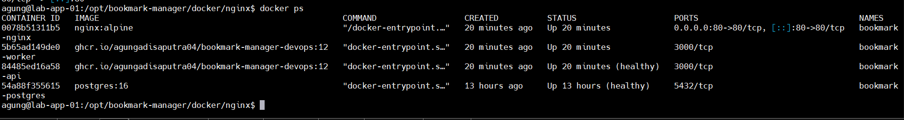
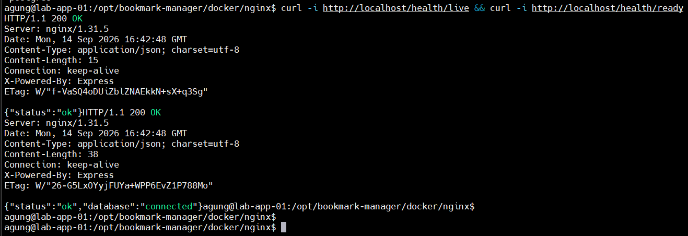
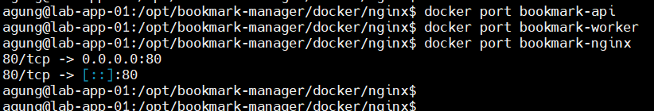

# Networking & Reverse Proxy

## Objective

Implement internal container networking and expose the application through an Nginx reverse proxy.

The API and PostgreSQL services are not directly exposed to the host. Nginx acts as the HTTP entry point and forwards requests to the internal API container.

## Architecture

```text
Client
  |
  | HTTP :80
  v
Nginx
:80
  |
  | Docker network
  | http://api:3000
  v
API
:3000
  |
  | PostgreSQL connection
  v
PostgreSQL
:5432

Worker
  |
  v
PostgreSQL
```

## Network Design

Docker Compose creates an internal application network for the services.

Service-to-service communication uses Docker DNS and service names rather than host IP addresses.

Examples:

- Nginx → `api:3000`
- API → `postgres:5432`
- Worker → `postgres:5432`

The API container listens on port `3000`, but the port is not published to the VM host.

PostgreSQL also does not publish port `5432` to the VM host.

Only Nginx publishes port `80`.

## Nginx Reverse Proxy

Nginx is configured as the external HTTP entry point.

```nginx
server {
    listen 80;
    server_name _;

    location / {
        proxy_pass http://api:3000;
        proxy_http_version 1.1;

        proxy_set_header Host $host;
        proxy_set_header X-Real-IP $remote_addr;
        proxy_set_header X-Forwarded-For $proxy_add_x_forwarded_for;
        proxy_set_header X-Forwarded-Proto $scheme;
    }
}
```

Request flow:

```text
HTTP request
     |
     v
VM101:80
     |
     v
Nginx
     |
     v
api:3000
     |
     v
Express API
```

## Deployment

The reverse proxy configuration is deployed through the CI/CD pipeline.

Deployment flow:

```text
GitHub
   |
   v
Jenkins
   |
   +--> Build & Test
   |
   +--> Build Docker Image
   |
   +--> Push Image to GHCR
   |
   +--> Copy Compose + Nginx configuration
   |
   v
VM101
   |
   v
Docker Compose
   |
   +--> PostgreSQL
   +--> API
   +--> Worker
   +--> Nginx
```

The application image deployed during validation was:

```text
ghcr.io/agungadisaputra04/bookmark-manager-devops:12
```

## Validation

### Container Status

All required containers were running:

- `bookmark-nginx`
- `bookmark-api`
- `bookmark-worker`
- `bookmark-postgres`

The API and PostgreSQL containers reported healthy status.

### Nginx Port

```bash
docker port bookmark-nginx
```

Result:

```text
80/tcp -> 0.0.0.0:80
80/tcp -> [::]:80
```

This confirms that Nginx is exposed on HTTP port `80`.

### API Port Isolation

```bash
docker port bookmark-api
```

Result:

```text
(no output)
```

This confirms that API port `3000` is not published to the VM host.

The API remains reachable internally through the Docker network.

### Liveness Through Nginx

```bash
curl -i http://localhost/health/live
```

Result:

```text
HTTP/1.1 200 OK

{"status":"ok"}
```

This confirms that the request reaches the API through Nginx.

### Readiness Through Nginx

```bash
curl -i http://localhost/health/ready
```

Result:

```text
HTTP/1.1 200 OK

{"status":"ok","database":"connected"}
```

This confirms:

1. Nginx can forward requests to the API.
2. The API is healthy.
3. The API can reach PostgreSQL.
4. PostgreSQL is available through the internal Docker network.

## Evidence

### 1. Container Status

All required services are running and the API/PostgreSQL containers are healthy.



### 2. Health Check Through Nginx

Requests to `/health/live` and `/health/ready` return HTTP 200 through Nginx.



### 3. Port Exposure

Only Nginx exposes a host port. The API port `3000` remains internal to the Docker network.



## Result

The reverse proxy architecture is successfully implemented and validated.

The resulting exposure model is:

| Service | Internal Port | Host Port | Exposure |
|---|---:|---:|---|
| Nginx | 80 | 80 | Public entry point |
| API | 3000 | - | Internal only |
| Worker | - | - | Internal only |
| PostgreSQL | 5432 | - | Internal only |

This provides a clean separation between the external HTTP entry point and internal application services.

The architecture is also ready for the next stage, where TLS/HTTPS can be terminated at Nginx.