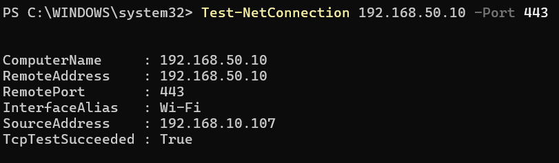
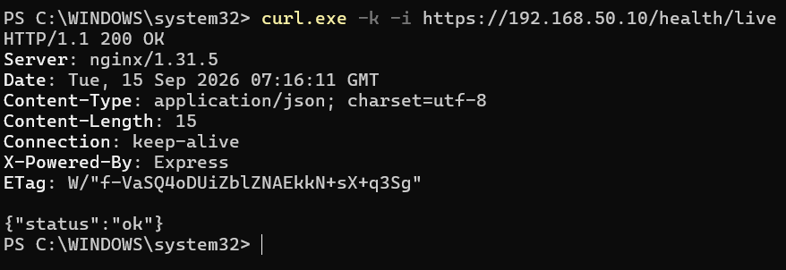
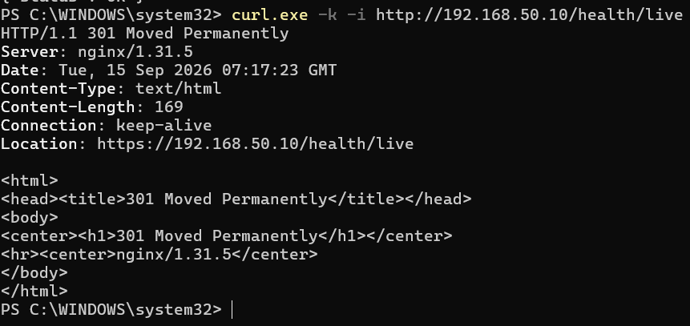
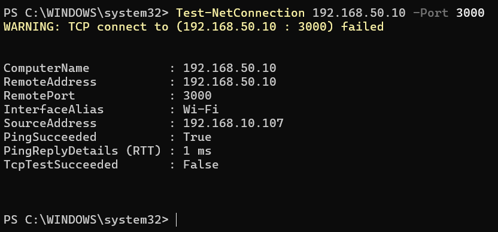

# TLS / HTTPS Validation

## Objective

Implement HTTPS termination on Nginx and ensure application traffic is exposed through HTTPS while the API container remains inaccessible directly from the host network.

## Architecture

```text
Client
  │
  │ HTTP :80
  ▼
Nginx
  │
  │ 301 Redirect
  ▼
HTTPS :443
  │
  │ TLS termination
  ▼
Nginx
  │
  │ HTTP internal
  ▼
API :3000
  │
  ▼
PostgreSQL

Worker ──► PostgreSQL
```

## TLS Configuration

Nginx handles TLS termination on port `443`.

The certificate and private key are mounted into the Nginx container:

```text
/etc/nginx/certs/server.crt
/etc/nginx/certs/server.key
```

The certificate used in this homelab is self-signed.

HTTP traffic received on port `80` is redirected to HTTPS:

```nginx
server {
    listen 80;
    server_name _;

    return 301 https://$host$request_uri;
}
```

HTTPS traffic is terminated by Nginx and proxied internally to the API:

```nginx
server {
    listen 443 ssl;
    server_name _;

    ssl_certificate /etc/nginx/certs/server.crt;
    ssl_certificate_key /etc/nginx/certs/server.key;

    location / {
        proxy_pass http://api:3000;
        proxy_http_version 1.1;

        proxy_set_header Host $host;
        proxy_set_header X-Real-IP $remote_addr;
        proxy_set_header X-Forwarded-For $proxy_add_x_forwarded_for;
        proxy_set_header X-Forwarded-Proto $scheme;
    }
}
```

## Network Exposure

Only Nginx exposes host ports:

```text
80/tcp  → Nginx
443/tcp → Nginx
```

The API does not expose port `3000` to the host.

Traffic from Nginx to the API uses the internal Docker network:

```text
Nginx → api:3000
```

This prevents direct external access to the application container.

## Validation

### HTTPS Port Reachability

From the Windows client:

```powershell
Test-NetConnection 192.168.50.10 -Port 443
```

Result:

```text
TcpTestSucceeded : True
```

### HTTPS Application Health

```powershell
curl.exe -k -i https://192.168.50.10/health/live
```

Result:

```text
HTTP/1.1 200 OK
Server: nginx/1.31.5

{"status":"ok"}
```

The `-k` option is required because the homelab currently uses a self-signed certificate.

### HTTP to HTTPS Redirect

```powershell
curl.exe -k -i http://192.168.50.10/health/live
```

Result:

```text
HTTP/1.1 301 Moved Permanently
Location: https://192.168.50.10/health/live
```

This confirms that HTTP traffic is redirected to HTTPS.

### API Direct Access

```powershell
Test-NetConnection 192.168.50.10 -Port 3000
```

Result:

```text
TcpTestSucceeded : False
```

This confirms that the API is not directly exposed through host port `3000`.

## Validation Summary

| Check | Expected | Result |
|---|---|---|
| TCP port 443 | Reachable | PASS |
| HTTPS `/health/live` | HTTP 200 | PASS |
| HTTP → HTTPS | HTTP 301 | PASS |
| Direct API port 3000 | Not reachable | PASS |
| Nginx → API | Internal Docker network | PASS |
| TLS certificate | Loaded by Nginx | PASS |

## CI/CD Deployment

TLS configuration is maintained in the Git repository and deployed through Jenkins.

Deployment flow:

```text
GitHub
  │
  ▼
Jenkins
  │
  ├── Test
  ├── Build Docker Image
  ├── Push to GHCR
  └── Deploy to VM101
          │
          ▼
      Docker Compose
          │
          ▼
        Nginx
       /     \
    :80      :443
               │
               ▼
             API
```

The Nginx configuration is therefore part of the application deployment rather than being maintained manually on the server.

## Security Note

The current certificate is self-signed because this environment is a private homelab without a public DNS name.

For a public production deployment, the next improvement would be a trusted certificate issued by a public Certificate Authority, such as Let's Encrypt.

## Evidence

### HTTPS Port Reachability



### HTTPS Health Check



### HTTP to HTTPS Redirect



### API Port Not Exposed



## Conclusion

TLS termination has been successfully implemented on Nginx.

The application is now accessed through HTTPS on port `443`, HTTP traffic is redirected to HTTPS, and the API port `3000` is no longer directly exposed to the host network.

The deployment configuration is maintained in Git and delivered through the existing Jenkins CI/CD pipeline.